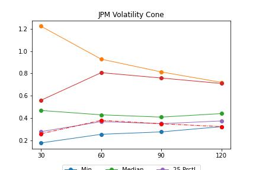

# How to tell if options are cheap with volatility cones

The hardest part of options trading is determining if they are cheap or expensive. Whether you buy or sell an option, you’re exposed to the volatility of the underlying. That’s why it’s important to compare volatility to its recent levels.

Volatility cones can help you do this.

---

## Step 1: Import the required libraries

  %matplotlib inline

  math

  yfinance

  numpy

  matplotlib

---

## Step 2: Read in the Data and Setup the variables

Use yfinance to get stock data – in this case, JPM is used. 
(You can use any stock and any price range you want)

Next, we’ll setup some variables which will be used as lists. 

*windows* defines the number of days used to compute volatility. 
*quantiles* defines the percentage of the top and bottom 25% of values. 

The last few lists are where we accumulate data to plot.

---

## Step 3: Realized volatility

Realized volatility is a measurement of how much the price or returns of stock vary. It’s used to optimize portfolios, detect regime changes, and price derivatives. The most common way to measure realized volatility is the standard deviation.

The next step is to loop through each of the windows and compute realized volatility over each time frame. estimator is a pandas DataFrame. That’s why it’s so easy so compute the min, max, median, and quantiles

---

Step 4: Plot the results

Create a chart that plots the volatility cone.

---

## Step 5: Analyze the results

The y-axis is the realized volatility over each time frame. The x-axis is time frame we use to compute the realized volatility.

There are three conclusions you can draw from this chart:

Over the 30-day window, there is a spike in realized volatility. Realized volatility spikes usually correspond to a drop in the stock price. This should tell us to explore the stock price to see what happened.
Realized volatility (the dashed line) is close to the lowest it’s been across all time frames. This is a data point to support a case to get long volatility (i.e. options are cheap).
Realized volatility is mean reverting. You can see this in the cone shape of the chart. This is a data point to support a case to get long volatility.
​
